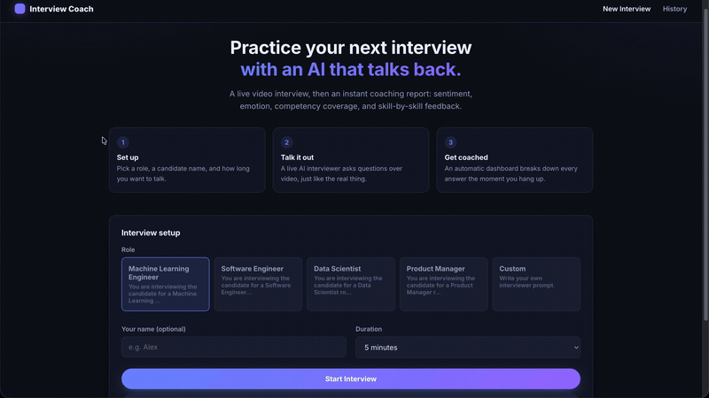
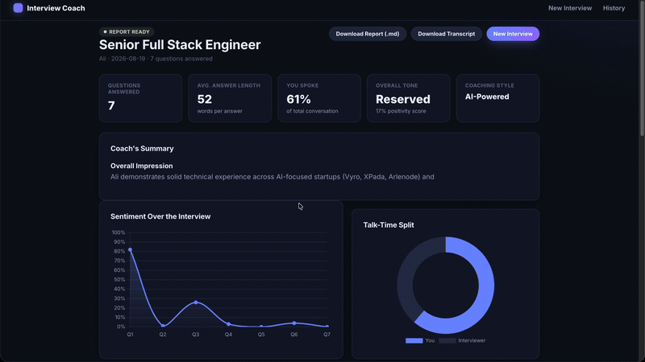

# Interview Coach

A live, AI-driven  interview tool. You talk to an AI interviewer over video
(powered by [Tavus](https://www.tavus.io)'s Conversational Video Interface),
and the moment you hang up, you get a full coaching dashboard: sentiment and
emotion per answer, competency coverage, detected hard skills, and — if you
add an OpenAI key — AI-written feedback on every response plus an overall
evaluation.

<p>
  
  
</p>

## What it does

1. **Set up** — pick a role (ML Engineer, Software Engineer, Data Scientist,
   Product Manager, or write your own prompt), your name, and a duration.
2. **Talk it out** — a live AI interviewer asks questions over video in your
   browser, for as long as you configured.
3. **Get coached** — as soon as the call ends, the app automatically pulls
   the transcript, analyzes it, and shows you a dashboard: a sentiment
   timeline, an emotion breakdown, competency coverage, detected hard
   skills, and a per-question accordion with coaching notes. Export the
   transcript or the full report as Markdown.


---
## Demo

Select the setup, enter your name, set your duration and start the interview.



A Live Interview.Talk it out.


Full Report of the interview.



---

## Quickstart

```bash
Python3 -m venv .venv

source .venv/bin/activate

python3 app.py
```

Then open **http://127.0.0.1:5000**. The first time you run it, the app
seeds two sample reports from real archived interviews into your history so
you can see the dashboard immediately — click **"View a Sample Report
Instead"** on the home page.

The very first analysis run will download two small local ML models
(~600MB total, one-time, cached under `~/.cache/huggingface`) — this can
take a minute or two depending on your connection.

## Getting API keys

### Tavus (required for live interviews)

1. Sign up at **https://platform.tavus.io** — there's a free tier, no card
   required to start testing.
2. Open the PAL Maker dashboard: **https://maker.tavus.io/dev** → click
   **"API Key"** in the sidebar → **"Create New Key"**. Copy it into
   `TAVUS_API_KEY` in `.env`.
3. You also need a **replica** (the AI interviewer's face + voice). Use a
   stock replica from your dashboard, or create your own at
   **https://platform.tavus.io/replicas**, then copy its ID into
   `TAVUS_REPLICA_ID`.
   - `.env` is pre-filled with `r9d30b0e55ac`, the replica this project used
     previously — check your Tavus dashboard to confirm it's still on your
     account before relying on it; replace it if not.
4. Optional: if you build a **Persona** in PAL Maker (custom LLM/voice
   config), set `TAVUS_PERSONA_ID` too.

### OpenAI 

Without this, the app still gives you full sentiment/emotion analysis,
competency tagging, and hard-skill detection — the summary is just
rule-based text instead of an AI-written evaluation, and there's no
per-answer coaching note.

Get a key at **https://platform.openai.com/api-keys**, put it in
`OPENAI_API_KEY`. Default model is `gpt-4o-mini` (cheap, fast); change
`OPENAI_MODEL` if you want something else.

**Never commit `.env` or paste your key into code.** This project's `.gitignore`
already excludes it.


## Running tests

```bash
source .venv/bin/activate
pytest -v
```

The test suite is fully offline and fast (~2s) — it mocks both the local ML
pipelines and the OpenAI client, and exercises real parsing logic against
the two archived interview transcripts in `tests/fixtures/`.

